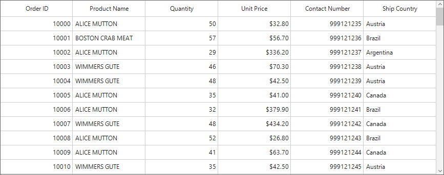

# How to display a column values in UpperCase in WinForms DataGrid (SfDataGrid)?

## About the sample

This example illustrates how to display a column values in UpperCase in WinForms DataGrid (SfDataGrid).

[WinForms DataGrid](https://www.syncfusion.com/winforms-ui-controls/datagrid) (SfDataGrid) allows you to display the record data in upper case for a specific column by using [SfDataGrid.DrawCell](https://help.syncfusion.com/cr/windowsforms/Syncfusion.WinForms.DataGrid.SfDataGrid.html#Syncfusion_WinForms_DataGrid_SfDataGrid_DrawCell) event


```C#

public Form1()
{
    InitializeComponent();

    this.sfDataGrid1.DrawCell += OnSfDataGrid1_DrawCell;
}

private void OnSfDataGrid1_DrawCell(object sender, Syncfusion.WinForms.DataGrid.Events.DrawCellEventArgs e)
{
    if(e.Column.MappingName == "ProductName")
    {
        e.DisplayText = e.DisplayText.ToUpper();
    }
}

```



## Requirements to run the demo 

Visual Studio 2015 and above versions.
